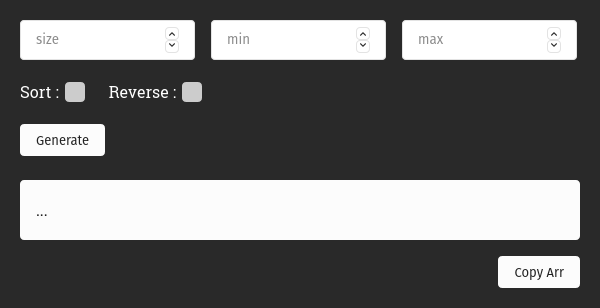

# Big Array Generator

<p>&nbsp;</p>

## Description

This is an array generator primarily created to generate HUGE SIZE ( 10000 > ) arrays.

There is also a Vs code extension: https://www.example.com

And Browser extensions to use in online editors.

- Firefox: https://mzl.la/2Ort5an

| Firefox Addon Look  |       Parameters        |
| :-----------------: | :---------------------: |
|  |  |

| An Array of Size 3 Million |
| :------------------------: |
|  |

## Installation

```
$ npm i big-array-generator
```

## Usage

```
const { generate } = require("big-array-generator")

/* Invoke the function */
generate({}) // => [23,99,10,50,2] (random array)
```

```
/* Default Params */
size: 5, min: 1, max: 100, sort: false, reverse: false

size = Length of the array
min = Minimum Value
max = Maximum Value
sort = Returns Sorted array
reverse = Returns Reverse Sorted array

/* Therefore */
generate({size: 12, min: 20, max: 42, sort: true}) // => [ 22, 24, 24, 26, 29, 30, 34, 35, 38, 38, 39, 40 ]

/* And Reverse */
generate({size: 6, max: 22, reverse: true}) // => [ 21, 15, 13, 11, 3, 2 ]

```
